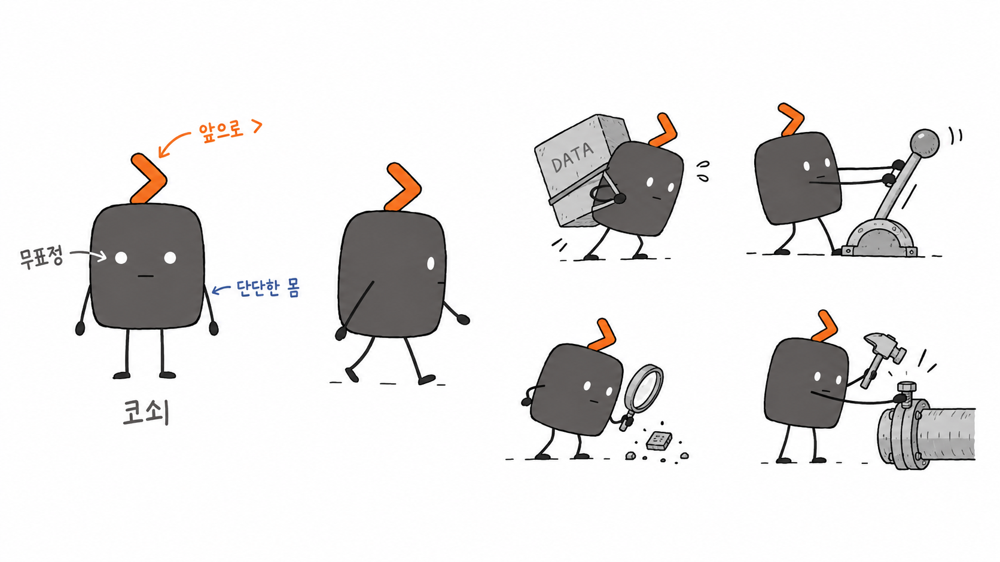
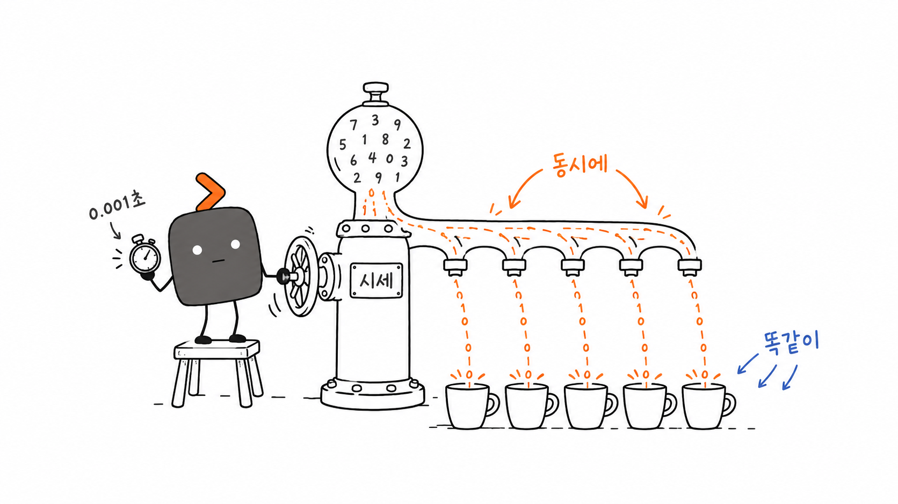
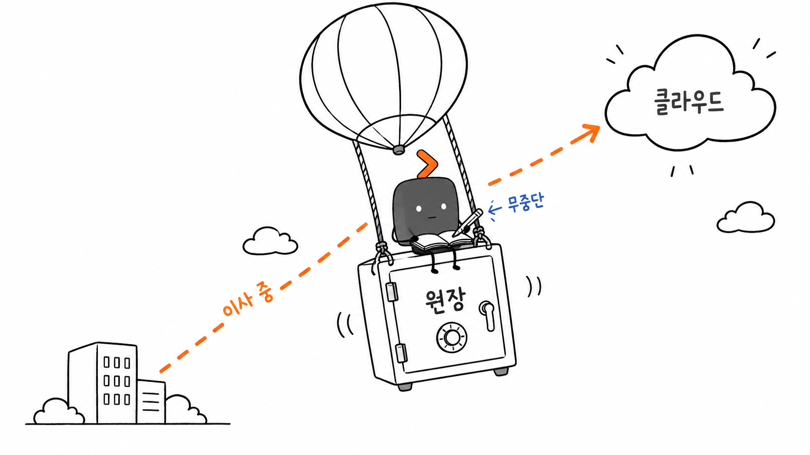
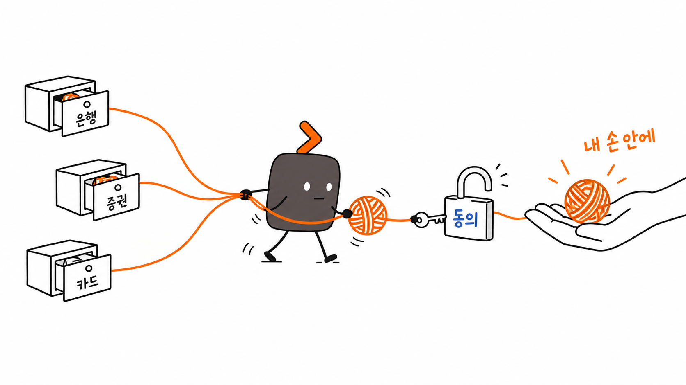
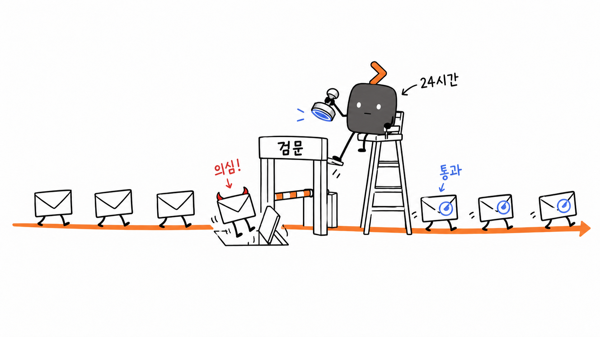
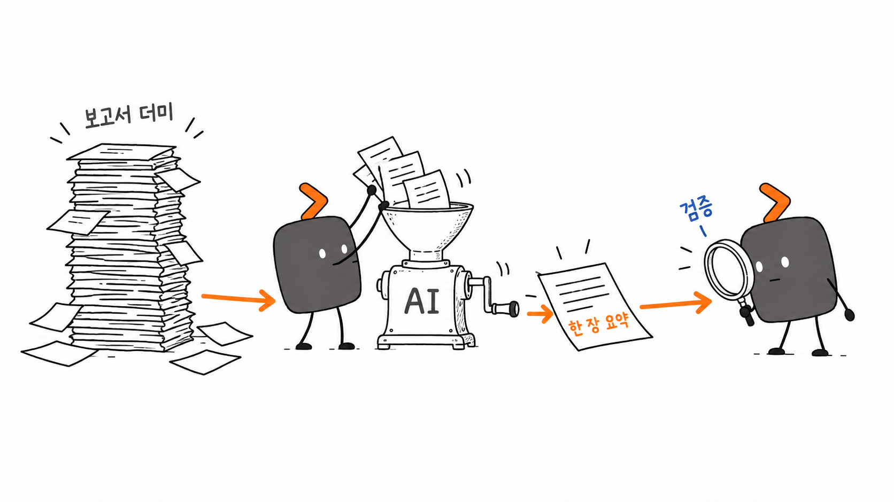
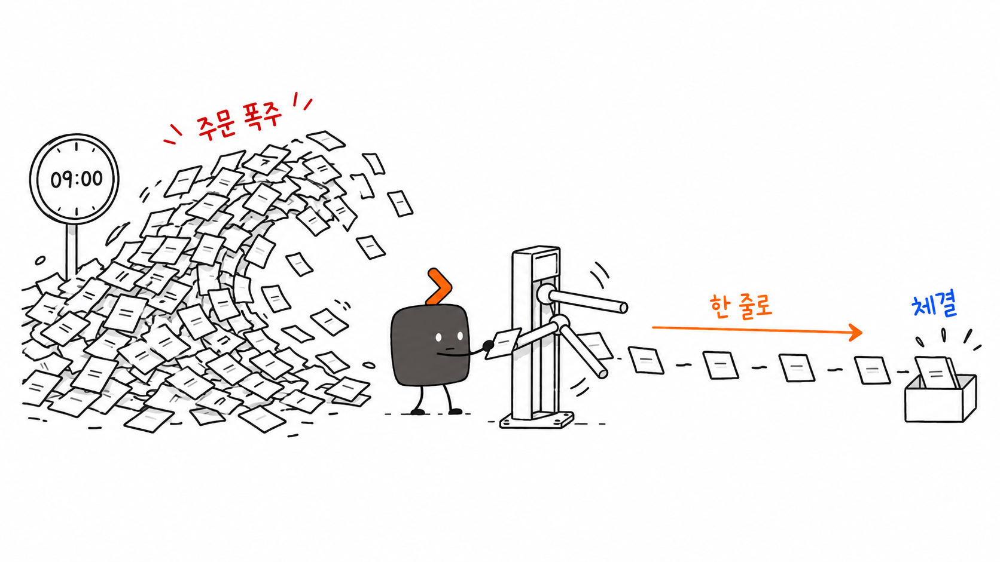
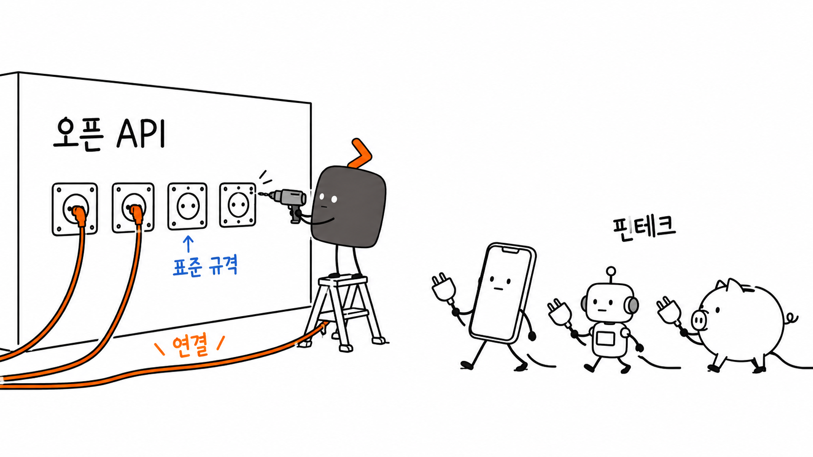

# 코스콤 코쇠 삽화 (Koscom Kosoe Illustrations)

> 한국어 문서 속 판단·흐름·구조·은유를, 흰 종이에 쓱 그린 엉뚱하지만 담백한 16:9 손그림 삽화로.
>
> 16:9 가로 | 코쇠 IP | 순백 손그림 | 코스콤 CI 오렌지·진회색 | Claude Code · Codex 스킬



---

## 무엇인가요?

사내 보고서, 기획서, 블로그, 뉴스레터, 교육 자료, Confluence/Notion 문서에 들어갈 **본문 삽화**를 AI 에이전트가 일관된 화풍으로 만들도록 돕는 스킬입니다.

범용 일러스트 프롬프트도, PPT 인포그래픽 템플릿도 아닙니다. 먼저 글의 **인식 앵커**(핵심 판단·병목·흐름·전후 비교·은유)를 찾고, 그중 하나를 기억에 남는 16:9 손그림 한 장으로 바꿉니다.

[Ian Xiaohei Illustrations](https://github.com/helloianneo/ian-xiaohei-illustrations)의 구조와 철학을 바탕으로, 캐릭터와 색을 코스콤에 맞게 새로 만들었습니다.

---

## 코쇠를 소개합니다

**코쇠 = 코스콤 + 꺾쇠(`>`) + 쇠(단단한 인프라)**

| 요소 | 디자인 | 의미 |
| --- | --- | --- |
| 몸통 | CI 진회색 `#5A5555`, 둥근 사각 키캡 모양 | 단단하고 믿음직한 자본시장 IT 인프라 |
| 꺾쇠 볏 | CI 오렌지 `#E96717`, 항상 오른쪽(앞)을 향함 | 코스콤 아이콘이 상징하는 **진취성** |
| 흰 점 눈·무표정 | 감정을 드러내지 않음 | 묵묵히, 0.001초도 허투루 보내지 않는 운영자 |
| 가는 팔다리 | 막대 같은 선 | 직접 레버를 당기고, 나르고, 검증하는 실무자 |

코쇠는 마스코트가 아닙니다. 그림의 **핵심 동작을 직접 수행하는 일꾼**입니다. 코쇠를 지워도 그림이 성립하면, 코쇠가 장식에 머문 것입니다.

> 꺾쇠 대신 조약돌 몸통을 가진 초기 시안은 [character/kosoe-alt-pebble.png](character/kosoe-alt-pebble.png)에 남겨 두었습니다. 원작 캐릭터와 실루엣이 겹쳐 채택하지 않았습니다.

---

## 화풍과 색

- 순백 배경, 진한 차콜의 가늘고 살짝 떨리는 손그림 선
- 넉넉한 여백 (주제 40~60%, 빈 공간 35% 이상)
- 한글 손글씨 라벨 3~5개, 각 2~8자
- 한 장에 핵심 하나
- 엉뚱하고 창의적이되 유치하지 않게, 깔끔하게

| 역할 | 색 | 사용처 |
| --- | --- | --- |
| 메인 | 오렌지 `#E96717` | 코쇠의 꺾쇠, 주 흐름·경로·화살표 |
| 코쇠 몸통 | 진회색 `#5A5555` | 코쇠에만 |
| 보조 | 블루 `#4368F2` | 보조 설명, 시스템 상태, 정상/통과 |
| 경고 | 레드 | 문제·위험 하나만 (한국 증시의 빨강=상승 관례에 주의) |

---

## 예시

모든 예시는 이 스킬의 프롬프트 템플릿과 캐릭터 시트를 레퍼런스로 Codex CLI에서 생성했습니다. 프롬프트 원문은 [examples/prompts/](examples/prompts/)에 있습니다.

### 시세 정보 배포 — 모두에게, 같은 순간, 같은 값


### 원장 시스템 클라우드 전환 — 이사 중에도 장부는 멈추지 않는다


### 마이데이터 — 흩어진 정보를, 동의 하에, 내 손 안에


### 24시간 보안 관제 — 수상한 건 문 앞에서


### AI 업무혁신 — 요약은 AI가, 검증은 사람이


### 매매체결 안정성 — 9시의 주문 폭주를 한 줄로


### 핀테크 오픈 플랫폼 — 표준 규격으로 연결


이 그림들은 **화풍 보정용**이지 구도 템플릿이 아닙니다. 스킬은 매번 글에 맞는 새 은유를 발명하도록 지시합니다.

---

## 설치

```bash
git clone https://github.com/humanist96/koscom-kosoe-illustrations.git
cd koscom-kosoe-illustrations
./install.sh            # Claude Code + Codex 둘 다
```

Windows PowerShell:

```powershell
.\install.ps1           # 또는 .\install.ps1 -Target claude / codex
```

수동 설치는 `koscom-kosoe-illustrations/` 폴더를 통째로 아래 위치에 복사하면 됩니다.

| 에이전트 | 경로 |
| --- | --- |
| Claude Code | `~/.claude/skills/koscom-kosoe-illustrations/` (프로젝트 전용은 `.claude/skills/`) |
| Codex | `~/.codex/skills/koscom-kosoe-illustrations/` |

### 이미지 생성 준비

- **Codex**: 내장 `image_gen` 도구를 바로 씁니다. 추가 설정 없음.
- **Claude Code**: 이미지를 직접 그리지 못하므로 스킬이 동봉된 `scripts/gen_image.sh`로 Codex CLI를 호출합니다.
  ```bash
  npm i -g @openai/codex
  codex login          # ChatGPT 계정 로그인 (구독 범위 내 생성, 별도 API 키 불필요)
  ```
  Windows에서는 Git Bash가 필요합니다 (Git for Windows에 포함).

---

## 사용법

### 기획만 (shot list)

```text
코쇠 삽화 스킬로, 아래 글에서 그림이 필요한 곳을 골라 5컷 정도 shot list만 먼저 뽑아줘.
각 컷마다 위치, 주제, 핵심 의미, 구조 유형, 코쇠가 하는 일, 한국어 라벨을 적어줘.

<글 붙여넣기>
```

### 바로 생성

```text
코쇠 삽화 스킬로 아래 보고서에 들어갈 본문 삽화 4장을 만들어줘.

<글 붙여넣기>
```

Codex에서는 `$koscom-kosoe-illustrations`로 명시 호출할 수 있습니다.

```text
Use $koscom-kosoe-illustrations 이 기획서에 들어갈 코쇠 삽화 3장 만들어줘.
```

### 개념 하나만

```text
코쇠 삽화로 "장애가 나도 서비스는 끊기지 않는다 — 이중화"를 한 장 그려줘.
코쇠가 핵심 동작을 맡게 해줘.
```

### 수정

```text
이 그림에서 왼쪽 위 "프로세스" 제목만 지우고 나머지는 그대로 둬.
```

```text
"체결" 라벨 철자가 깨졌어. 그 라벨만 고쳐줘.
```

### 스크립트 직접 사용

```bash
bash koscom-kosoe-illustrations/scripts/gen_image.sh my-prompt.txt out/01-topic.png \
  koscom-kosoe-illustrations/assets/kosoe-character-sheet.png
```

프롬프트 작성법은 [prompt-template.md](koscom-kosoe-illustrations/references/prompt-template.md)를 참고하세요.

---

## 워크플로

1. 글·문서·스크린샷을 읽고 핵심 주장과 인식 전환 지점을 찾는다
2. shot list: 컷마다 인식 앵커 하나
3. 구조 유형 선택 — 워크플로 / 시스템 부분도 / 전후 비교 / 상태 변화 / 개념 은유 / 계층 / 경로 / 짧은 만화
4. 로우테크 물리 은유를 새로 발명 (분수대, 회전문, 금고, 실타래, 검문소…)
5. 코쇠가 그 동작을 수행
6. 캐릭터 시트를 레퍼런스로 붙여 한 장씩 생성
7. QA: 순백·여백·코쇠 디자인·코쇠 동작·한글 라벨·PPT 느낌 아님·로고 없음
8. `assets/<article-slug>-illustrations/`에 저장하고 용도·경로 보고

---

## 폴더 구조

```text
.
├── README.md
├── LICENSE / NOTICE.md
├── install.sh / install.ps1
├── character/                       # 캐릭터 시트와 시안, 시트 생성 프롬프트
├── examples/
│   ├── images/                      # README 예시 이미지
│   └── prompts/                     # 예시 생성 프롬프트 원문
└── koscom-kosoe-illustrations/      # ← 실제로 설치되는 스킬
    ├── SKILL.md
    ├── agents/openai.yaml           # Codex 표시 정보
    ├── assets/
    │   ├── kosoe-character-sheet.png  # 생성 시 항상 첨부하는 기준 이미지
    │   └── examples/
    ├── references/
    │   ├── style-dna.md
    │   ├── kosoe-ip.md
    │   ├── composition-patterns.md   # 금융 IT 주제별 은유 씨앗 포함
    │   ├── prompt-template.md
    │   └── qa-checklist.md
    └── scripts/gen_image.sh          # Codex CLI 이미지 생성 래퍼
```

---

## 주의

- 한글 라벨은 짧을수록 정확합니다. 오탈자가 많으면 라벨 수를 줄여 다시 생성하세요.
- 이미지 모델 특성상 코쇠 디자인이 가끔 흔들립니다(검은 몸, 꺾쇠 방향 등). 캐릭터 시트를 꼭 레퍼런스로 붙이고, QA 체크리스트로 거르세요.
- 이 저장소는 코스콤 공식 CI 자산이 아니며 로고 파일을 포함하지 않습니다. 대외 배포물은 사내 브랜드 담당 부서 검토를 거치세요. 자세한 내용은 [NOTICE.md](NOTICE.md).

---

## 크레딧

- 원작 스킬 구조와 철학: [Ian Xiaohei Illustrations](https://github.com/helloianneo/ian-xiaohei-illustrations) by Ian (MIT)
- 캐릭터 코쇠, 한국어·코스콤 맥락 재작성, 예시 이미지: 이 저장소

## License

MIT License. [LICENSE](LICENSE) 참고.
